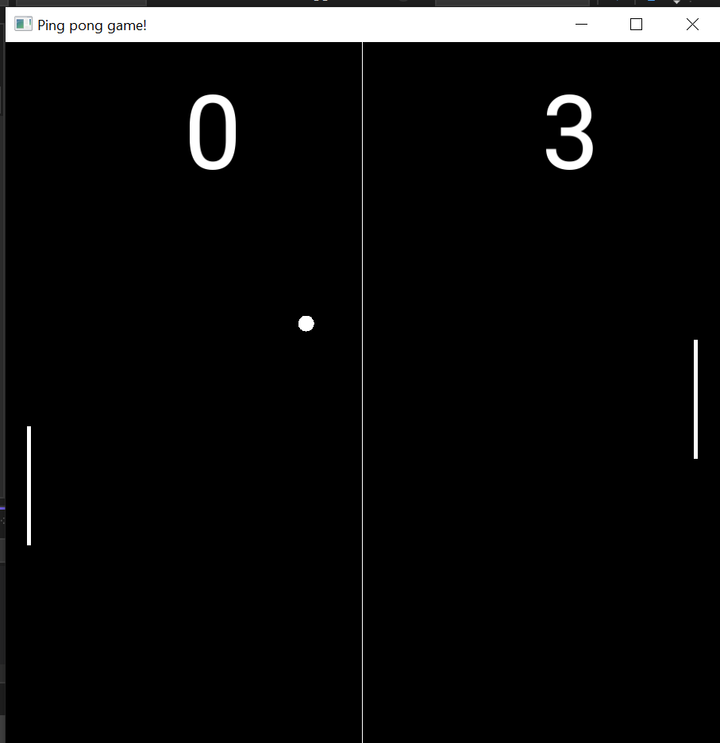

# C++ PingPong game

**GameMain.cpp** is the main file wich contains main loop of the game

## Project building

To successfully build and run this project locally, the following steps will be required:

### Step 1: Install the required software

- **MSVC 19x** The project was assembled and written using this version of the compiler
- **ISO C++ 20 Standard**
- **SFML Library**

### Step 2: Build and run GameMain.cpp

### The final app descriptions

By default the starts 0 | 0 and it will be finished when some one (player, or AI) score 5 poings. If you want to change final score, use FINAL_SCORE constant. 
Also if you want to change AI hard mode use AI_HARD_COEFFICIENT, by default it is 1 (the hardest). If you want to change any others parameters of the game use constants at the beginning of the file.

  

